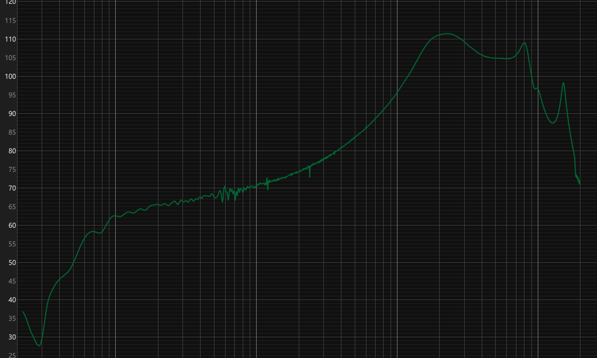

# REW 轉 AutoEQ

[English](README.en.md)

把 [REW](https://www.roomeqwizard.com/)（Room EQ Wizard）的頻率響應匯出檔，轉成 [AutoEQ](https://autoeq.app) 可以直接讀取的 CSV。

REW 匯出的量測檔是純文字檔，通常會包含 `* ...` 開頭的註解行，以及 `Freq(Hz), SPL(dB), Phase(degrees)` 這類欄位。AutoEQ 則預期一個只有 `frequency,raw` 兩欄、數值是相對 dB 的 CSV。這個工具負責兩者之間的轉換：讀取 REW 匯出檔、過濾頻段、內插到對數間隔的頻率格點、可選的分數倍頻程平滑、轉成相對 dB，最後輸出 AutoEQ 可用的 CSV。

## 功能

- 解析 REW 文字匯出檔（逗號或 Tab 分隔，有無標題列都可以）
- 支援常見編碼，包含 UTF-8、Big5、GB18030
- 可限制輸出頻段（預設 20 Hz - 20 kHz）
- 內插到 1/20 倍頻程的對數頻率格點，符合 AutoEQ 資料慣例
- 可選分數倍頻程高斯平滑（`--smooth 1/3`、`1/6` 等）
- 正規化模式：平均（預設）、中位數、指定參考頻率、或不正規化
- 支援批次轉換（`--output-dir`）
- 純 Python 標準函式庫，無額外依賴

## 安裝

不需要安裝也能直接跑：

```bash
python rew_to_autoeq/cli.py measurement.txt
```

安裝成指令列工具：

```bash
pip install git+https://github.com/xup61069/rew-to-autoeq.git
```

安裝後可使用：

```bash
rew2autoeq measurement.txt
```

## 使用方式

```bash
rew2autoeq <input.txt> [options]
```

範例：

```bash
# 基本轉換；預設在輸入檔旁邊產生 <input>_autoeq.csv
rew2autoeq measurement.txt

# 指定輸出檔
rew2autoeq measurement.txt -o my_eq.csv

# 1/3 倍頻程平滑
rew2autoeq measurement.txt --smooth 1/3

# 以 1 kHz 為 0 dB 做正規化
rew2autoeq measurement.txt --normalize reference --reference-freq 1000

# 批次轉換整個資料夾
rew2autoeq *.txt --output-dir converted/

# 保留原始絕對 SPL 數值和原本頻率解析度
rew2autoeq measurement.txt --no-normalize --no-interpolate
```

## 主要選項

| 選項 | 說明 |
| --- | --- |
| `-o, --output` | 輸出 CSV 路徑（只能用在單一輸入檔） |
| `--output-dir` | 批次轉換的輸出資料夾 |
| `--smooth OCTAVES` | 分數倍頻程平滑寬度，例如 `1/3`、`1/6`、`0.3` |
| `--normalize MODE` | `mean`、`median`、`reference` 或 `none`（預設 `mean`） |
| `--reference-freq HZ` | 搭配 `--normalize reference` 使用的參考頻率 |
| `--min-freq HZ` | 保留的最低頻率（預設 20） |
| `--max-freq HZ` | 保留的最高頻率（預設 20000） |
| `--steps-per-octave N` | 內插格點解析度（預設 20） |
| `--no-interpolate` | 保留 REW 原始頻率解析度 |
| `--quiet` | 只印出轉換後的檔案路徑 |
| `--version` | 顯示版本 |

## 輸出格式

產出的 CSV 只有兩欄：

```csv
frequency,raw
20.00,0.89
20.71,0.98
...
```

把這個檔案上傳到 [autoeq.app](https://autoeq.app)，就可以產生 parametric EQ 設定。

## 從 REW 匯出

在 REW 中使用 **File > Export > Measurement text file**（或你使用版本的對應匯出選項）。預設的逗號分隔匯出檔可以直接使用，不需要特別設定。

## 使用案例：洩壓耳塞套

入耳式耳機（IEM）配戴密封耳塞時，耳道內會累積氣壓造成不適。洩壓（透氣）耳塞套，例如 Sancai、Divinus Velvet 等，透過小孔平衡氣壓來解決這個問題。但同時低頻也會從小孔洩漏，通常在 200 Hz 以下衰減 10-20 dB。

這個工具提供一條簡單的補償流程：

1. 用 REW 搭配 IEC 711 耦合器量測裝上洩壓耳塞套的 IEM。
2. 用這個工具（`rew2autoeq`）把量測結果轉成 AutoEQ 格式。
3. 把 CSV 上傳到 [autoeq.app](https://autoeq.app) 產生 parametric EQ 補償。

### 範例

下圖是洩壓耳塞套造成的低頻衰減（注意 200 Hz 以下的明顯滾降）：



經過 AutoEQ 處理後，產生的補償 EQ 類似：

| 濾波器 | 頻率 | Q 值 | 增益 |
|--------|-----------|-------|--------|
| Peaking | 30 Hz   | 0.59  | +9.6 dB |
| Peaking | 30 Hz   | 0.18  | +12.0 dB |
| Peaking | 84 Hz   | 0.18  | +12.0 dB |
| Peaking | 1750 Hz | 1.28  | -11.9 dB |
| Peaking | 6667 Hz | 0.18  | -7.9 dB |

低頻的三個濾波器把低頻推回原始水準，高頻的兩個衰減則補償洩壓孔和耳塞套幾何結構造成的共振。實際數值會因 IEM 型號、耳塞型號和耳道耦合而異，務必量測自己的設備。

### 實用建議

- 選用能保持良好密封的最大尺寸耳塞，密封越好需要補償的低頻洩漏越少。
- 洩壓孔直徑很重要：孔越大洩壓效果越好，但低頻洩漏也越多，需要在個人感受和音質之間取得平衡。
- 更換耳塞後要重新量測，即使是同型號不同批次，製造公差和材料老化都可能改變頻率響應。
- 泡棉耳塞也能洩壓（壓縮後回彈），但它們對高頻的衰減特性與矽膠洩壓耳塞不同。

## 開發與測試

```bash
python -m unittest discover -s tests -v
```

## 相關資源

- [AutoEq](https://github.com/jaakkopasanen/AutoEq) — 自動化耳機等化（16k+ stars）
- [REW (Room EQ Wizard)](https://www.roomeqwizard.com/) — 免費的室內聲學和音訊量測軟體
- [autoeq.app](https://autoeq.app) — 從頻率響應 CSV 產生 parametric EQ 的線上工具
- Reddit 上關於 IEM 氣壓和洩壓耳塞的討論：
  - [How to alleviate IEM ear pressure -- lack of vents](https://www.reddit.com/r/iems/comments/1kqaea2/) (r/iems)
  - [Who else suffers from IEM pressure issues?](https://www.reddit.com/r/headphones/comments/ubwdab/) (r/headphones)
  - [What is this hole in my earbuds?](https://www.reddit.com/r/headphones/comments/yvwu8v/) (r/headphones)

## License

MIT